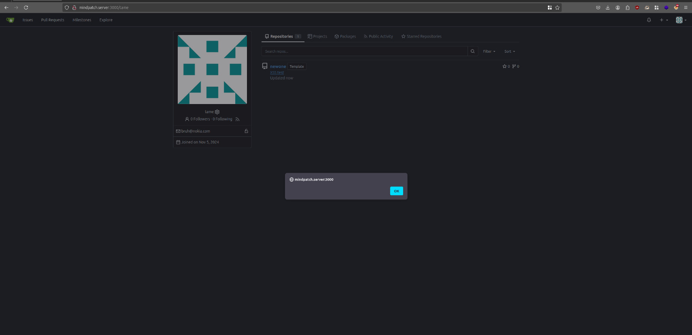

## CVE-2024-6886 - Stored XSS in Gitea

### Overview

Gitea version **1.22.0** has a Stored Cross-Site Scripting (XSS). This means that attackers can put harmful scripts into the server, and these scripts stay there. When another user interacts with the script, it runs in their browser, which could lead to stolen information, unauthorized actions, or other security problems. This issue can be very dangerous if an attacker has enough access to change the repository's description.

This flaw is serious because it allows attackers to run JavaScript code in a user's browser without them knowing. The vulnerability is easy to exploit because attackers only need basic permissions to change the repository details. Once the bad script is added, it stays in the system and affects anyone who views the compromised repository.

### Problem Description

This Stored XSS problem happens because the repository description field does not properly check the user input. Attackers can add harmful HTML and JavaScript code because the input isn't cleaned or validated. Without proper checks, bad actors can take advantage of this flaw and compromise the application.

When someone clicks on the infected description, the script runs in their browser. This lets the attacker do many bad things, like stealing cookies, authentication tokens, or other private data. The attacker could also use JavaScript to send users to unsafe websites or perform actions on their behalf.

This problem is even more dangerous when many people work on the same repository. Any user who views or edits the affected repository could be impacted by the harmful scripts. Since the script is stored on the server, it continues to be a threat until the vulnerability is fixed.

### Proof of Concept (PoC)

1. Log in to the Gitea instance with valid credentials.

2. Create a new repository or edit an existing one by going to the repository's settings page (`$username/$repo_name/settings`). Make sure you have permission to modify the repository.

3. In the Description field, enter the following code:

    ```
    <a href=javascript:alert()>XSS</a>
    ```

4. Save the changes. The settings will be updated without any error or warning.

5. Go to the repository's main page and click on the description to trigger the script. An alert box will pop up, showing that the script was successfully executed in the user's browser

    
    

These steps show how an attacker can use this vulnerability to harm the application, steal information, or act on behalf of other users without their permission.

#### References

- [Fix Commit](https://github.com/go-gitea/gitea/commit/b6280f4d21309cfae7cc07f74173354c664d5e10)
- [Fix Pull Request](https://github.com/go-gitea/gitea/pull/31200)


These links explain how the problem was fixed, including the changes made to properly clean user input and stop harmful scripts from running. It is highly recommended that users update to the latest version to fix this vulnerability.

### Credits
- Catalin Iovita
- Alexandru Postolache
